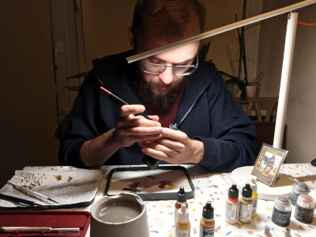

---
hide:
  - navigation
  - title
---
{ class=crop-left-mug }

I'm an IT engineer with a passion for gaming.
Heroes of Might and Magic III has always been one of my favourite games.
That's why when a board game crowdfunding was announced, I backed it in a heartbeat.
I helped create some of the community-made projects, like [Rule Book Rewrite](https://github.com/Heegu-sama/Homm3BG), [Fan-Made Mission Book](https://github.com/qwrtln/Homm3BG-mission-book), and the game [Wiki](https://homm3bg.wiki/).

Since the game came with 100+ minis, I decided to take on a new hobby and paint them.
On this website I'll be sharing the results of my work.

You can read this website in English, [Polish](https://pl.paint-h3.qwrtln.nl), or [Russian](https://ru.paint-h3.qwrtln.nl).
