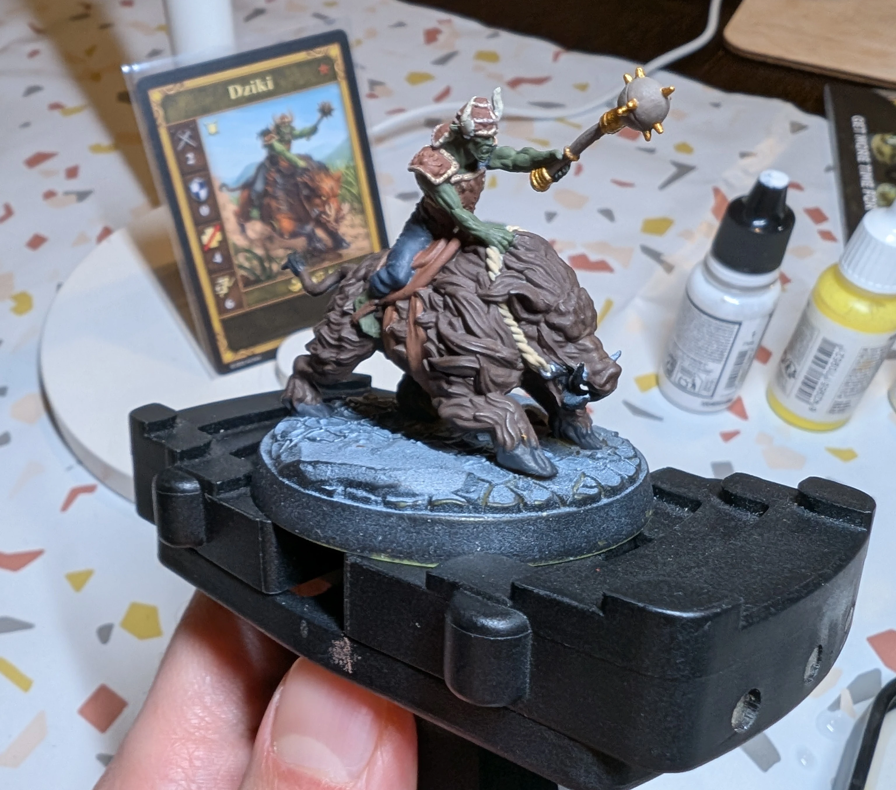

# Boar
<small>Read in another language: [:pl:](https://pl.paint-h3.qwrtln.nl/posts/2025/02/dzik/) [:ru:](https://ru.paint-h3.qwrtln.nl/posts/2025/02/боров/)</small>

My first mini with a large 5 cm base.
I kept falling into the "just one more brush stroke" trap.

  
  

Click to see the unboxing video

  <video width="1280" height="720" controls preload="none">
    <source src="/assets/videos/boar.webm" type="video/webm">
  </video>

See Boars on the [Wiki](https://homm3bg.wiki/units/boars).

Despite my efforts, matching the original colors was nearly impossible, especially for the animal's fur.
One must master the dry-brush technique on simpler subjects before attempting more formidable creatures like dragons.

### The Process

I started with the base colors (though skipping some details like the beast's fangs) without planning the entire process.

/// caption
Base colors with zenithal priming visible on the base
///

I purposefully made the fur dark (brown + black) to create contrast with the orange highlights added later.
After initial attempts, I abandoned the black lowlights as the results were underwhelming.
The second layer was painted with orange + brown to match the card's color, and the final highlights were applied using dry-brushing with pure orange.

What remained were the facial details of both beast and rider, proper highlights for the goblin's skin, edge highlights on the saddle, and armor details.
With so many similar colors, choosing the appropriate pallette was challenging.

The base is painted in desert tan with Agrax Earthshade in the recesses.
The stones are black with a touch of blue for a slight grey appearance.

### Conclusion

I shouldn't hesitate to use stronger highlights.
Additionally, distinguishing between similar colors should be planned before starting the project.

Having a wife who is a designer is invaluable - she helps me break through creative blocks.
