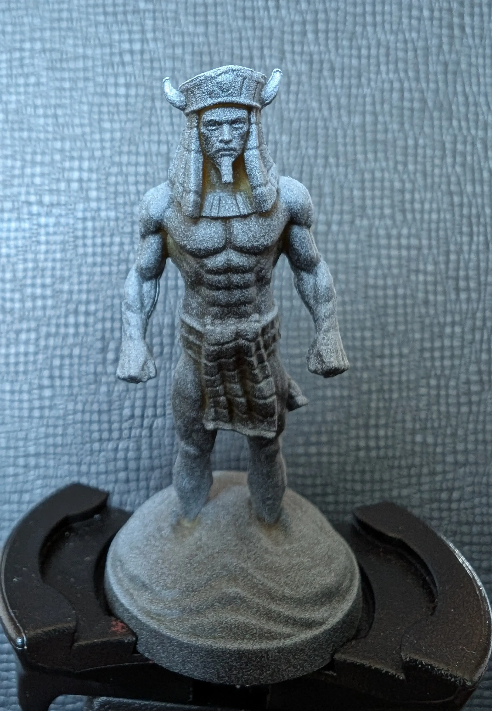
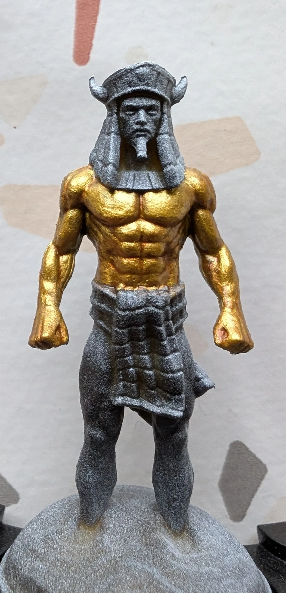

# Gold Golem
<small>Read in another language: [:pl:](https://pl.paint-h3.qwrtln.nl/posts/2025/02/złoty-golem/) [:ru:](https://ru.paint-h3.qwrtln.nl/posts/2025/02/золотой-голем/)</small>

Painting muscles with metallics is a very rewarding experience - the gold catches light beautifully and accentuates the sculpted physique.

<!--more-->

  

    
  

  

    
    
  

Click to see the unboxing video

  <video width="1280" height="720" controls preload="none">
    <source src="/assets/videos/gold-golem.webm" type="video/webm">
  </video>

### The Plan

Most of the mini will be covered with metallics, which shine on their own.
The usual zenithal priming helps bring out all the details of the mini.

{width="400px"}
///caption
The hands are too pale, but other than that all the details are clearly visible.
///

{width="400px"}
///caption
The Pharaoh never skipped the leg day.
///

### The Process

I started with covering the upper body with AK's old gold, then a layer of Reikland Fleshshade to darken the recesses, and then a final layer of Vallejo's gold.

{width="400px"}
///caption
Those simple steps already make the golem's "skin" look good.
///

{width="400px"}
///caption
For comparison, legs with a single layer of old gold.
///

{width="400px"}
///caption
Legs with all the layers.
///

With Pharaoh clothes, one needs to be very careful with the fine details.
I chose my thinnest synthetic brush for this task.
Blue with azure for highlights for one part, gold for everything else.

{width="400px"}
///caption
Reikland Fleshshade again for face shading, and off-white for the eyes.
///

For the pants, I used the same colors as for the cap, with one difference: I opted for Agrax Earthshade to give it some depth.

{width="400px"}
///caption
With metallics, it's more difficult to make an even layer, into which wash can flow.
///

What was left, was the sand base.
Dry-brushing and stippling helped give the sand texture and a consistent tone.

{width="400px"}
///caption
A final look helps find places to fix. Look at the collar - metallics overspilled a little.
///

### Conclusion

Key learnings:

- Painting with metallics is rather straightforward.
No wonder people opt for Non-Metallic Metal.

- Don't use your best brushes with metallics!
Natural fur gets damaged all too easily.
