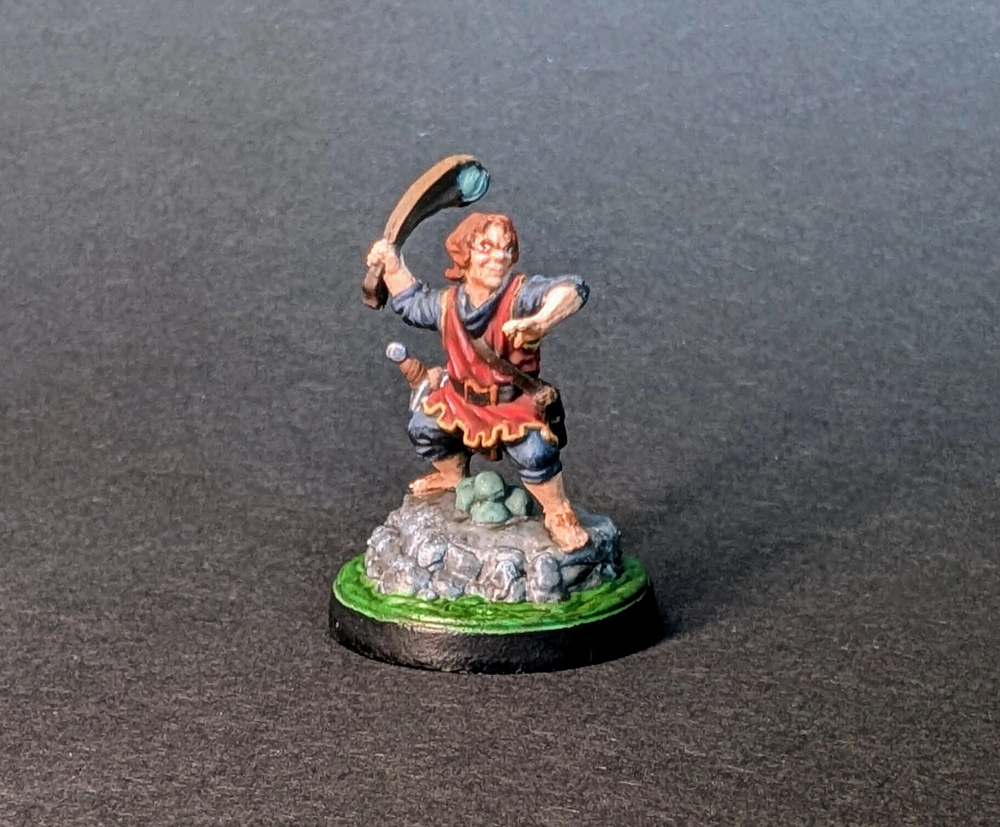

# Halfling
<small>Read in another language: [:pl:](https://pl.paint-h3.qwrtln.nl/posts/2025/02/niziołek/) [:ru:](https://ru.paint-h3.qwrtln.nl/posts/2025/02/полурослик/)</small>

A tiny but challenging miniature to paint.

  
  

Click to see the unboxing video

  <video width="1280" height="720" controls preload="none">
    <source src="/assets/videos/halfling.webm" type="video/webm">
  </video>

All the details are painted reasonably well.
The face, on the other hand, is in a league of its own, which my skills can't match up to.
The eyes could obviously be improved, but I'd rather leave them as they are, so that I can compare them with my future work and see the progress.

See Halflings on the [Wiki](https://homm3bg.wiki/units/halflings).
