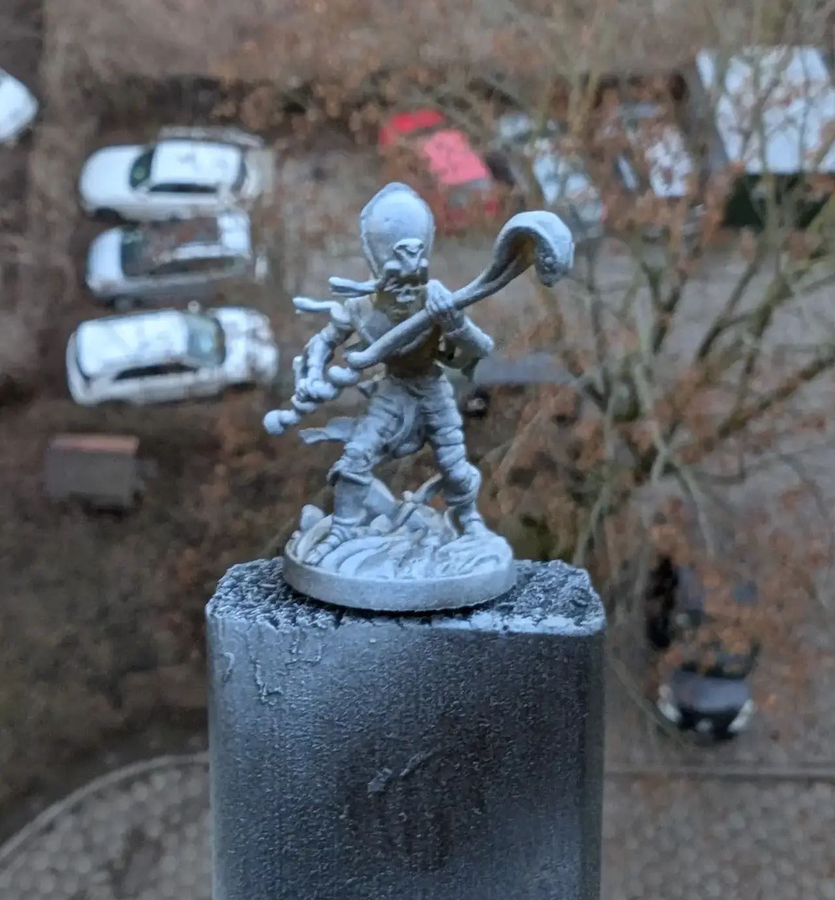

# Mummy
<small>Read in another language: [:pl:](https://pl.paint-h3.qwrtln.nl/posts/2025/02/mumia/) [:ru:](https://ru.paint-h3.qwrtln.nl/posts/2025/02/мумия/)</small>

Painting this mini reminded me of [Eddie](https://en.wikipedia.org/wiki/Eddie_(Iron_Maiden)), Iron Maiden's mascot in their Powerslave album.

  

    
  

  

    
  

Click to see the unboxing video

  <video width="1280" height="720" controls preload="none">
    <source src="/assets/videos/mummy.webm" type="video/webm">
  </video>

See Mummies on the [Wiki](https://homm3bg.wiki/units/mummies).

The lighting in these miniature photos has a yellow tint due to experimental lighting setup.
It will only get better.

### The Plan

As usual, I start with zenithal priming:

 - Black spray all-around the mini in short gusts

 - 2-3 even shorter gusts of white

 - Areas hard to reach with a brush become visible

/// caption
I finally learned how to spray both economically and effectively
///

The card art shows clear resemblance to Ancient Egypt and pharaohs, calling for sand-like tones with hints of nobility.

/// caption
Initial palette choice
///

/// caption
Mixing up base color for those venerable bandages
///

### The Process

Starting with the bandages proved straightforward.

/// caption
Base color needs a second coat for full coverage
///

Protruding bandages make natural highlight targets.
The forgiving texture allows room for brush imprecision.

Metallics presented the main challenge, particularly the scepter.
While reference colors appear similar, available paints required adaptation:

 - Applied thin gold metallic over brown base for subtle shine

 - Pure gold metallic for remaining metallic areas

### Conclusion

Key learnings:

 - Gold metallic requires dedicated base layer for proper coverage

 - Reference colors deserve more literal interpretation

 - Snake head tip could benefit from white and orange reflections instead of uniform brown

 - Remember: we're creating an illusion of reality
