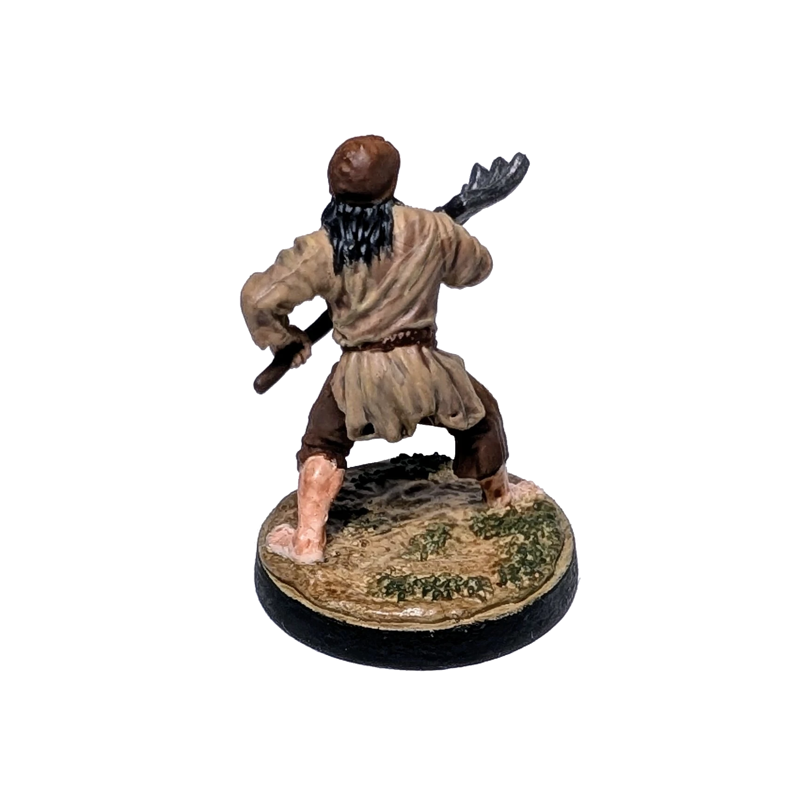

# Peasant
<small>Read in another language: [:pl:](https://pl.paint-h3.qwrtln.nl/posts/2024/11/chłop/) [:ru:](https://ru.paint-h3.qwrtln.nl/posts/2024/11/крестьянин/)</small>

Becoming Pieter Bruegel for one afternoon.
Let's give this peasant some character before he ends up in the skeleton transformer.

Painting time: 4 h

Click to see the unboxing video

  <video width="1280" height="720" controls preload="none">
    <source src="/assets/videos/peasant.webm" type="video/webm">
  </video>

See Peasants on the [Wiki](https://homm3bg.wiki/units/peasants).

For the first time, I decided not to follow the colors on the card, as they were too vibrant.
An actual peasant would likely wear more muted clothing — violet shirts wouldn’t be in their wardrobe.
The mini ended up with earthy, autumn-inspired tones.

### The Process

I used a flat brown for the base of the trousers, pitchfork, and cap, but this wasn’t the best choice.
Follwing my wife's suggestion, I brightened the trousers and cap with a bit of orange, while darkening the pitchfork handle.

The shirt and the ground were too similar in color, making the mini hard to look at.
Luckily, there was enough grass, which I dry-brushed with the color I usually use for zombie skin.
Even this subdued color helped the mini feel more alive.

The pitchfork was painted with gunmetal, with silver edges, and a touch of black ink to tone down the shine.
To give the peasant a dirtier look, I used watered-down Dreadful Visage contrast paint as a wash.

### Conclusion

My hand is getting steadier.
Here's to keeping this up before I run out of easy-to-paint neutral minis.
