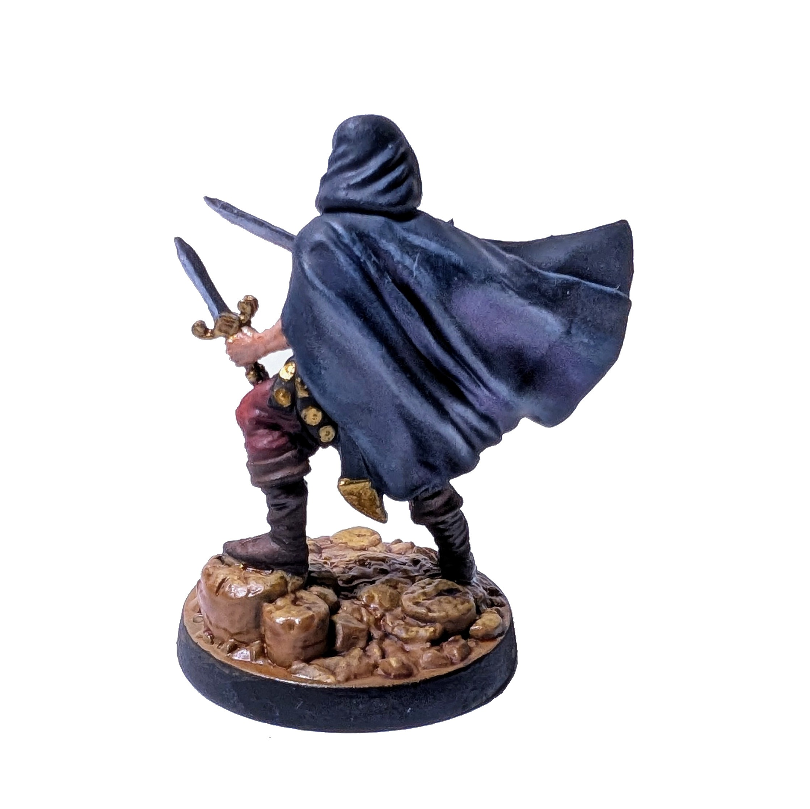

# Rogue

I started painting neutral units to gain some experience first.

My first ever painted Heroes mini.
Overall, very happy with the result.
I like how the shading and highlhting turned out, especially the cloak, boots, trousers, and even the face.
That said, you can see beginner's unsteady hand in the metallic details.
The base ended up a bit too glossy as well — probably from overusing the wash.

Painting time: 5 h

See Rogues on the [Wiki](https://homm3bg.wiki/units/rogues).

Click to see the unboxing video

  <video width="1280" height="720" controls>
    <source src="assets/videos/rogue.webm" type="video/webm">
  </video>

