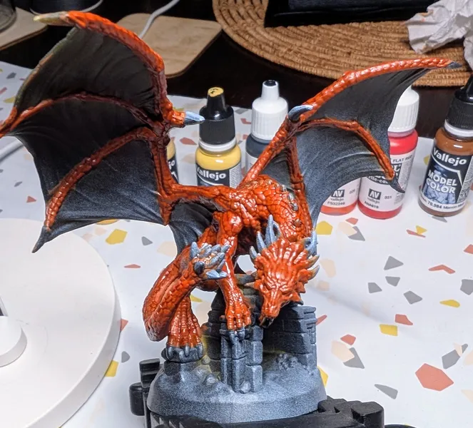
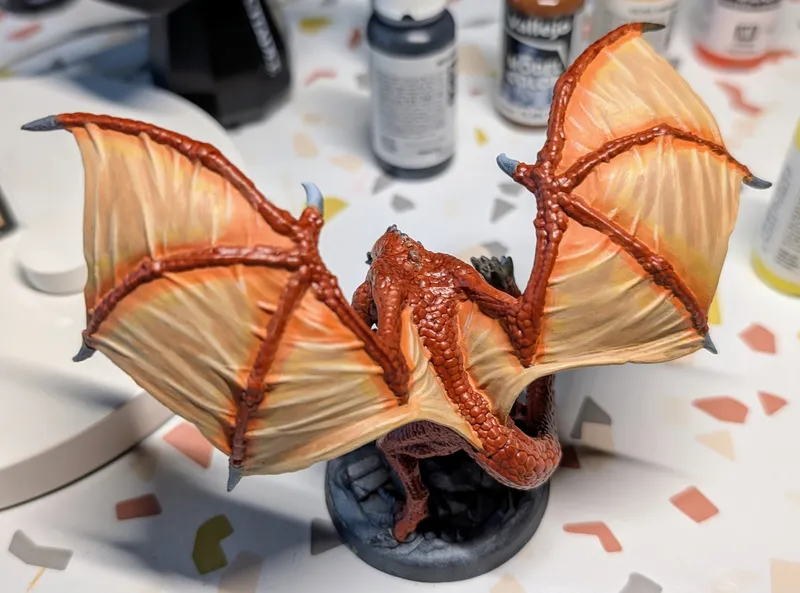
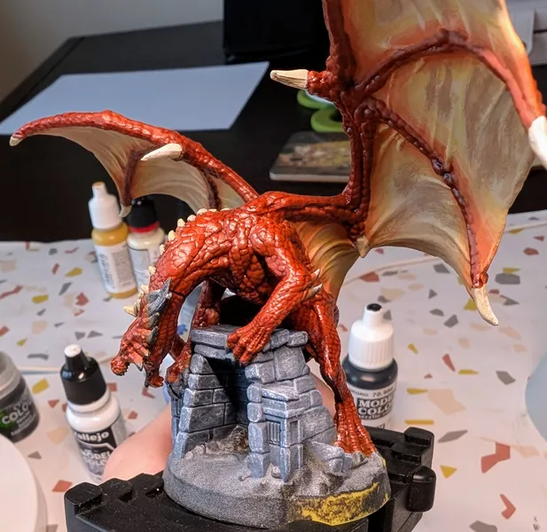
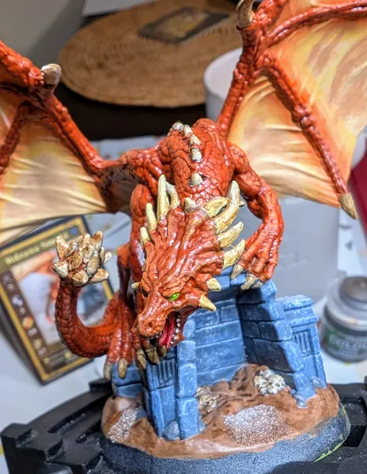

# Rust Dragon
<small>Read in another language: [:pl:](https://pl.paint-h3.qwrtln.nl/posts/2025/02/rdzawy-smok/) [:ru:](https://ru.paint-h3.qwrtln.nl/posts/2025/02/ржавый-дракон/)</small>

While Rust Dragons ranked as the third strongest unit in the video game, their position was swapped with Crystal Dragons in the board game version.

  

    
  

  

    
  

Click to see the unboxing video

  <video width="1280" height="720" controls preload="none">
    <source src="/assets/videos/rust-dragon.webm" type="video/webm">
  </video>

See Rust Dragons on the [Wiki](https://homm3bg.wiki/units/rust_dragons).

### The Plan

This miniature is significantly larger than most others, so it requires a customized approach.
First, I'll cover the large areas of the same color using a cat tongue brush, and then I'll move on to the details.

### The Process

Looking at the reference card, the dragon has orange scales.
A mix of orange with a splash of brown should make a good base color.

#### Scales

I covered the entire dragon's body using a large cat tongue brush.

/// caption
The color is weak, it will require multiple coats.
///

Apply as many layers as needed for full coverage.

/// caption
Several layers later.
///

Finish with a matching wash to darken the recesses between the scales.

/// caption
Reikland Fleshshade wash works its magic.
///

#### Wings

The wings need a brighter color with gradient-like transitions around the bone structure.
First, I covered the areas not directly adjacent to the dragon's body.

/// caption
Base layer for the wings.
///

/// caption
More coats with darker edges.
///

At this stage, I realized it would be better to cover all the wings with the same color and use glazing around the bone structure.
However, not all is lost.
Highlights will give the wings more volume, and the transitions can still be smoothed out.

/// caption
Initial wing highlights.
///

/// caption
Inner highlights.
///

#### Claws

The claws are relatively straightforward to paint.
I'll add weathering and highlights in a later stage.

/// caption
I left the head unpainted to focus on it later.
///

#### Base

The base for this miniature is quite complex.
It features a building-like structure, earth, stones, skulls, and snow in the reference picture.
I started with the building.

/// caption
Applied grey with a hint of blue, azure around the edges, and dry-brushed white for texture.
///

/// caption
Both sides need careful dry-brushing.
///

/// caption
The stones in the back were painted without the blue tint.
///

For the ground, I chose a mud-like color with patches of melting snow.
I used AK's Ice Sparkles for the snow effect.

/// caption
Earth with patches of melting snow.
///

/// caption
Skulls of unfortunate adventurers inside.
///

#### Head

The head is the focal point of the miniature, so its details and highlights should be the most prominent.
I carefully painted the beast's snout, applied the strongest highlights, and added a glow effect to the eyes.

/// caption
Snout with glowing eyes.
///

Finally, I painted the head's spikes.
I achieved the weathering effect using Agrax Earthshade wash, which I then applied to all the remaining thorns.

/// caption
Weathered thorns complete the miniature.
///

### Conclusion

Key learnings:

 - Use a cat tongue brush for large surfaces to save time

 - Painting eyes is manageable with the right brush

 - Creating gradient transitions is easier with glazing than by hand

 - Designer wife is gold, but friends letting you try some gear you haven't bought yet, that's silver
