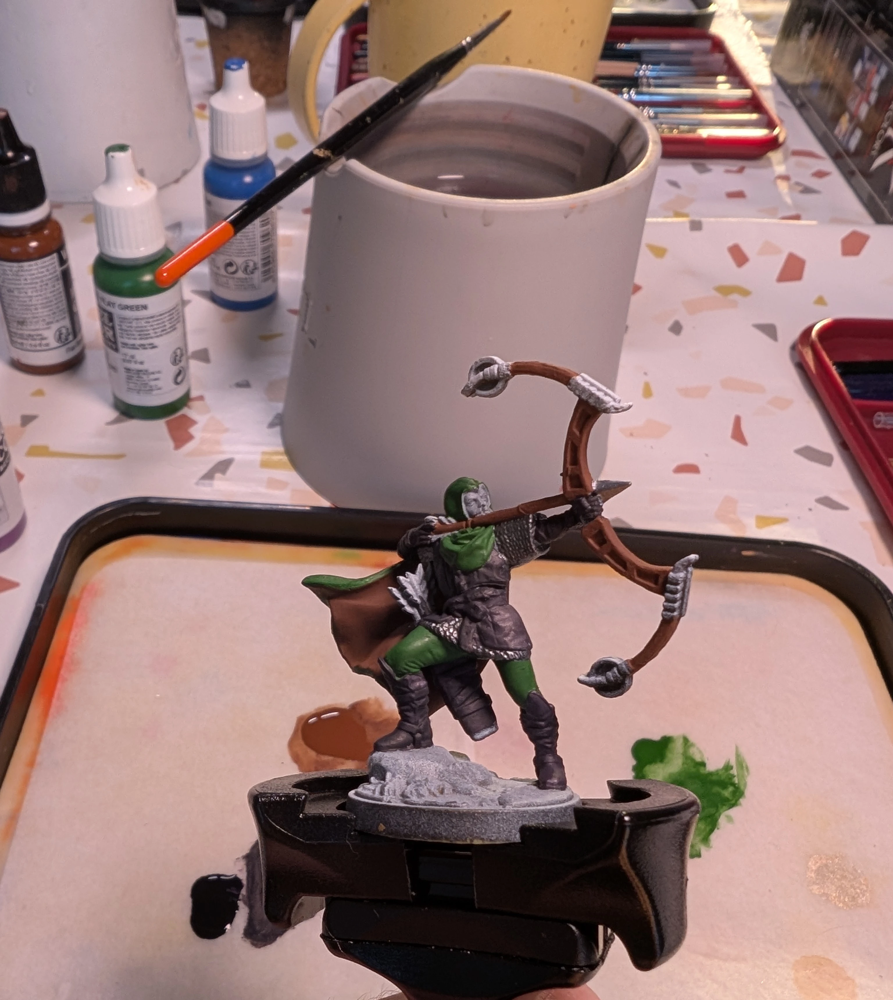
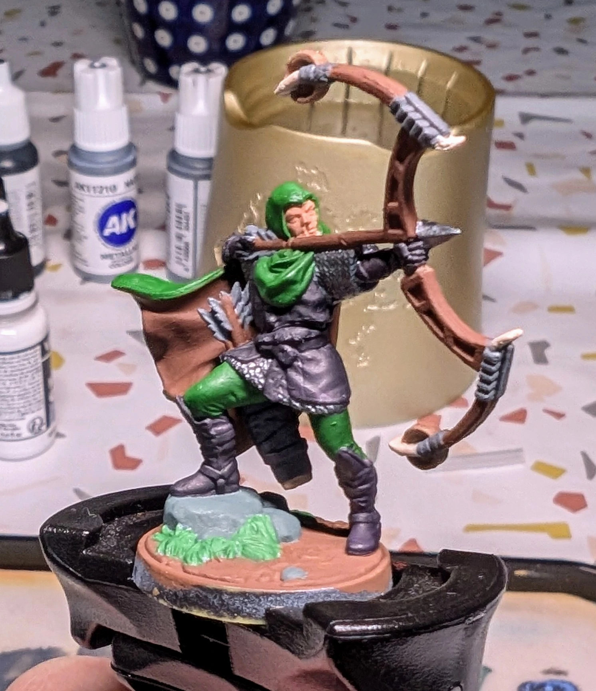

# Sharpshooter
<small>Read in another language: [:pl:](https://pl.paint-h3.qwrtln.nl/posts/2025/03/strzelec/) [:ru:](https://ru.paint-h3.qwrtln.nl/posts/2025/03/снайпер/)</small>

A flamboyant cloak is always fun to paint.

<!--more-->

  

    
  

  

    
    
  

Click to see the unboxing video

  <video width="1280" height="720" controls preload="none">
    <source src="/assets/videos/sharpshooter.webm" type="video/webm">
  </video>

I need to row back on my previous statements regarding the limited helpfulness of YouTube tutorials.
[Vince Venturella's guide to highlighting](https://youtu.be/W8uCKcF3aUc) was incredibly helpful.
Key conclusion: we're painting light, not actual colors.

### The Process

Let's start with a tip on motivation: it's a lot harder to procrastinate when you paint with friends.

/// caption
A makeshift painting workshop for two on a kitchen table.
///

To progress quickly, first paint big surfaces with a big brush.
The cloak and the bow are obvious choices (flat brown and flat green).
The rest is gun metal for chain mail, and black + purple for leather clothes.
I wonder if actual medieval sharpshooters dressed so stylishly.

/// caption
Those small details left to paint are quite time-consuming.
///

/// caption
Base layers done. See that cup in the background? It's golden now, ha-ha.
///

With base layers done, I progressed to highlighting using orange on brown, yellow on green, purple on black, and steel on gun metal.
This time, I used wash sparingly: only on the base and in the recesses of the bow (which in reality would be holes).
Also, don't forget to dry-brush your rocks.
This technique is so awesome it should be illegal.

### Conclusion

Key learnings:

 - Watch [Vince's video](https://youtu.be/W8uCKcF3aUc), if you haven't already. No, but really. He's a top-tier mini painter.

 - It actually helps to put your mini under a strong beam of light to see where highlights and shadows should be.

 - Do your friend who hasn't painted in a while a favor, and invite them over for a painting session.
