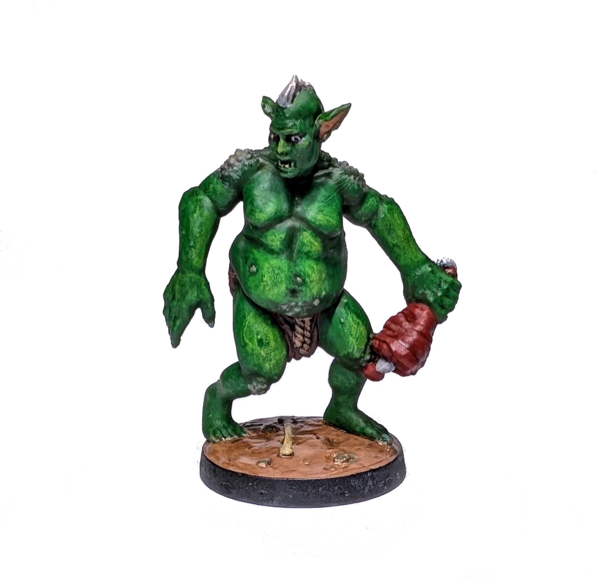
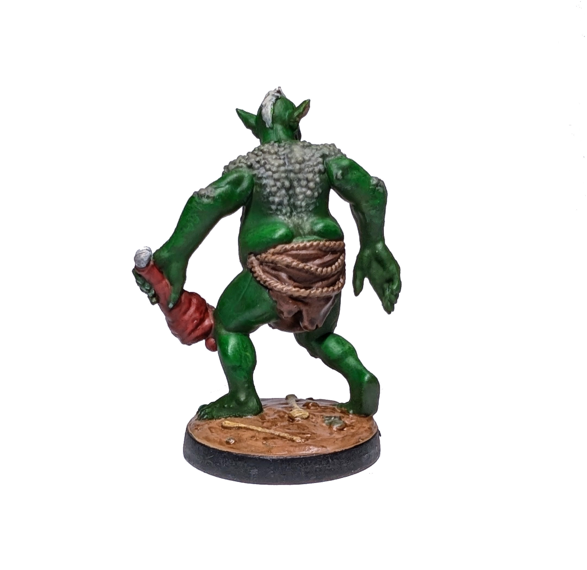

# Troll

Here's my second neutral unit.

<!--more-->

Green skin is supposedly easier to paint than human skin.
Well, that crusty texture was not as straightforward (it involved some wonky dry-brushing).
Nevertheless, those yellow-tinted highlights turned out really well.
This was also my first attempt at painting facial details like eyeballs and teeth.
I'm really glad it worked out on the first try.

Painting time: 5 h

See Trolls on the [Wiki](https://homm3bg.wiki/units/trolls).

Click to see the unboxing video

  <video width="1280" height="720" controls preload="none">
    <source src="/assets/videos/troll.webm" type="video/webm">
  </video>

